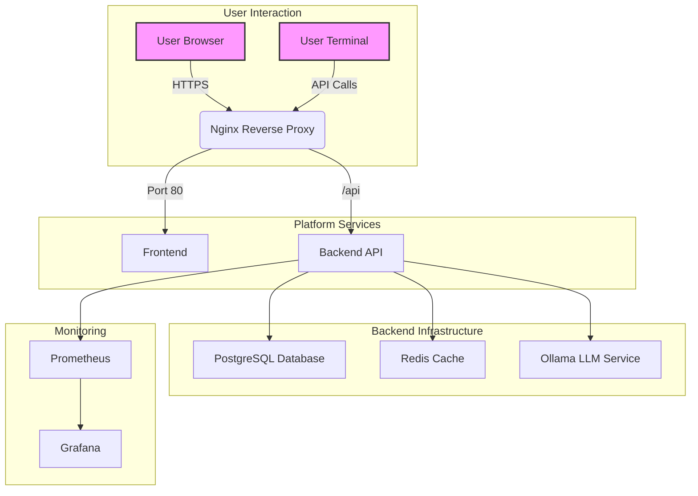

# dLNk Attack Platform - Project Documentation

**Version:** 2.0.0
**Date:** 2025-10-26
**Author:** Manus AI

---

## 1. Introduction

The dLNk Attack Platform is an advanced, AI-powered cybersecurity testing and offensive security framework. It is designed to automate and enhance penetration testing, vulnerability assessment, and red teaming operations. The platform integrates a powerful Large Language Model (LLM) to drive intelligent decision-making, automate complex attack chains, and discover novel vulnerabilities, including potential zero-days.

This document provides a comprehensive overview of the project's architecture, features, components, and setup instructions.

### 1.1. Key Features

- **AI-Powered Attack Orchestration:** Utilizes an LLM to dynamically plan and execute attack workflows.
- **Modular Agent System:** A flexible architecture with specialized agents for various security tasks (e.g., scanning, exploitation, reconnaissance).
- **RESTful API:** A comprehensive API for programmatic control, integration, and management of the platform.
- **Modern Frontend:** A responsive and user-friendly web interface built with React and TypeScript.
- **Command-Line Interface (CLI):** A powerful CLI for power users and automation scripts.
- **Real-time Monitoring:** WebSocket-based real-time updates, logging, and system health monitoring.
- **Scalable Architecture:** Built with FastAPI and PostgreSQL, designed for scalability and performance.
- **CI/CD and DevOps:** Automated testing, security scanning, and deployment pipeline using GitHub Actions and Docker.

## 2. System Architecture

The platform is built on a modern, decoupled architecture, consisting of a backend API, a frontend web application, and a suite of supporting services, all containerized with Docker.

### 2.1. Component Overview

| Component         | Technology        | Description                                                                 |
|-------------------|-------------------|-----------------------------------------------------------------------------|
| **Backend API**   | FastAPI, Python   | The core of the platform, handling business logic, attack orchestration, and data. |
| **Frontend**      | React, TypeScript | The user-facing web interface for managing and visualizing attacks.         |
| **Database**      | PostgreSQL        | Primary data store for attacks, results, users, and configurations.         |
| **Cache**         | Redis             | Used for caching, session management, and as a message broker for background tasks. |
| **LLM Service**   | Ollama            | Hosts the Large Language Model that powers the AI decision-making engine.     |
| **CLI**           | Python, Click     | A command-line tool for interacting with the platform.                      |
| **Reverse Proxy** | Nginx             | Manages incoming traffic, SSL termination, and serves the frontend application. |
| **Monitoring**    | Prometheus, Grafana | Collects metrics and provides dashboards for system monitoring.                 |

### 2.2. Architecture Diagram

## 3. Backend API

The backend is a RESTful API built with **FastAPI**. It serves as the central nervous system of the platform.

### 3.1. Key Modules

- **API Routes (`/api/routes`):** Defines all API endpoints for attacks, authentication, admin, etc.
- **Services (`/api/services`):** Contains the business logic for managing resources. The service layer pattern is used to separate logic from the API endpoints.
- **Core (`/core`):** Includes the main orchestrator, agent manager, LLM integration, and monitoring systems.
- **Database (`/api/database`):** Manages database connections, schema, and models.
- **Middleware (`/api/middleware`):** Provides request/response processing, including error handling, authentication, and rate limiting.

## 4. Frontend

The frontend is a single-page application (SPA) built with **React** and **TypeScript**.

### 4.1. Key Components

- **Components (`/src/components`):** Reusable UI components like Layout, Login, Dashboard, and custom controls.
- **Pages (`/src/pages`):** Main views of the application.
- **Services (`/src/services`):** Manages API communication.
- **State Management:** Utilizes React Hooks and Context API for managing application state.
- **Styling:** Uses **Tailwind CSS** for a utility-first styling approach.

## 5. Command-Line Interface (CLI)

The CLI, built with **Click** and **Rich**, provides a comprehensive set of commands for interacting with the platform from the terminal.

### 5.1. Key Commands

- `dlnk attack <url>`: Launch a new attack.
- `dlnk status <attack_id>`: Check the status of an attack.
- `dlnk history`: View attack history.
- `dlnk admin keys create`: Create a new API key.
- `dlnk config init`: Initialize the CLI configuration.

## 6. Installation and Setup

Please refer to the `INSTALLATION_GUIDE.md` for detailed instructions on how to set up the development and production environments.

## 7. CI/CD Pipeline

The project uses **GitHub Actions** for its Continuous Integration and Continuous Deployment (CI/CD) pipeline. The workflow is defined in `.github/workflows/ci-cd.yml` and includes the following stages:

1.  **Testing:** Runs backend (Pytest) and frontend (Jest/Vitest) tests.
2.  **Linting & Static Analysis:** Checks code quality and style.
3.  **Security Scanning:** Uses Trivy and Bandit to scan for vulnerabilities and security issues.
4.  **Docker Build:** Builds and pushes Docker images to a container registry.
5.  **Deployment:** Deploys the application to a production server.

---

*This document was automatically generated by Manus AI.*

